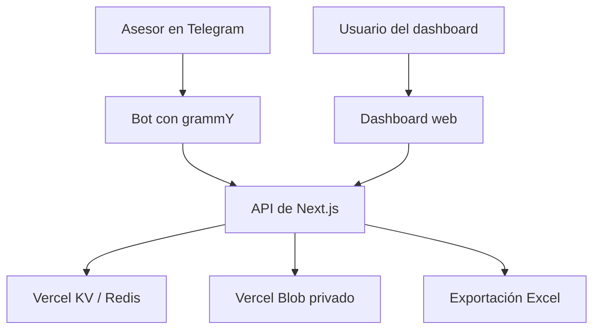

# PropBot C21 — Control de cierres inmobiliarios

Sistema web para registrar, revisar y analizar cierres inmobiliarios de **Century 21 Rita Quiroga**. Integra un bot de Telegram para la captura guiada de información y un dashboard administrativo con métricas, metas, comisiones, gestión de asesores, usuarios y perfiles.

## Estado del proyecto

- Aplicación desplegada en Vercel.
- Rama estable y de producción: `main`.
- Integración continua mediante GitHub Actions y validaciones de Vercel.
- Módulo de gestión de usuarios y perfiles incorporado en el PR #1.
- Gestión integral de asesores y estructura organizacional incorporada en el PR #2.
- Último cierre documentado en `main`: commit de merge `517bc8e`.

## Objetivos

- Estandarizar el registro de cierres inmobiliarios.
- Reducir errores mediante un flujo conversacional validado.
- Centralizar la revisión y administración de operaciones.
- Controlar el acceso mediante roles y permisos.
- Visualizar métricas, metas, captaciones, comisiones y objetivos.
- Exportar la información operativa a Excel.
- Mantener una arquitectura preparada para nuevas automatizaciones.

## Arquitectura general



### Flujo principal

1. Un asesor autorizado inicia el registro desde Telegram.
2. El bot solicita y valida los datos de la operación.
3. El cierre se guarda en Redis con estado pendiente de revisión.
4. Un usuario autorizado revisa la operación desde el dashboard.
5. La información alimenta métricas, gráficos, metas y reportes.
6. Los cierres pueden exportarse a un archivo `.xlsx`.

## Stack tecnológico

| Área              | Tecnología                              |
| ----------------- | --------------------------------------- |
| Framework         | Next.js 14.2.35 con App Router          |
| Lenguaje          | TypeScript 5                            |
| Interfaz          | React 18 y Tailwind CSS 3               |
| Iconografía       | Lucide React                            |
| Gráficos          | ApexCharts, React ApexCharts y Recharts |
| Fechas            | date-fns, Flatpickr y React Flatpickr   |
| Validación        | Zod                                     |
| Bot               | grammY                                  |
| Base de datos     | Vercel KV sobre Redis                   |
| Archivos privados | Vercel Blob                             |
| Autenticación     | JWT con `jose` y cookies `httpOnly`     |
| Contraseñas       | bcryptjs                                |
| Exportación       | ExcelJS                                 |
| Hosting           | Vercel                                  |
| CI/CD             | GitHub Actions y Vercel                 |

## Funcionalidades

### Dashboard

- Resumen de indicadores operativos.
- Gráficos de cierres por asesor y evolución de registros.
- Selector de rango de fechas.
- Diseño adaptable a escritorio y dispositivos móviles.
- Navegación lateral colapsable.
- Compatibilidad con tema claro y oscuro.
- Menú de usuario con avatar, nombre, cargo y acceso al perfil.

### Cierres inmobiliarios

- Registro guiado mediante Telegram.
- Consulta y revisión desde el dashboard.
- Vista individual de cada cierre.
- Estados de validación.
- Visualización de comprobantes de pago.
- Exportación a Excel.
- Cálculos asociados a comisiones.

### Asesores

- Lista autorizada de asesores que pueden utilizar el bot.
- Registro desde `/dashboard/asesores/crear`.
- Perfil administrativo individual en `/dashboard/asesores/[telegramId]`.
- Asociación única mediante el identificador de Telegram.
- Registro y edición de nombre, celular y estado.
- Carga y actualización de fotografía privada.
- Vista previa y progreso durante la carga de la fotografía.
- Oficina global visible en el perfil.
- Gestión independiente de categoría, Team y Equipo Triple 21.
- Creación y administración de agrupaciones organizacionales.
- Activación y desactivación desde el listado o el perfil.
- Búsqueda por nombre, Telegram ID, celular o categoría.
- Paginación del listado para volúmenes superiores a diez asesores.
- Tabla administrativa en escritorio y tarjetas compactas en móvil.
- Edición desplegable en móvil, manteniendo una sola tarjeta abierta.
- Confirmaciones visuales para registro, edición, fotografía y cambios organizacionales.
- Redirección al listado actualizado después de completar el registro y la carga opcional de fotografía.
- Conservación de datos organizacionales históricos en cierres y exportaciones.
- Integración de la estructura del asesor con el flujo del bot.
- Captaciones y metas mensuales.

### Metas y gestión comercial

- Metas mensuales por asesor.
- Captaciones mensuales.
- Objetivos generales de oficina.
- Configuración de comisiones.
- Cuenta de comisión.
- Indicadores de avance y cumplimiento.

### Usuarios y perfiles

- Creación de usuarios desde `/dashboard/usuarios/crear`.
- Listado administrativo en `/dashboard/usuarios`.
- Ficha individual en `/dashboard/usuarios/[username]`.
- Edición de información personal, rol y estado.
- Confirmación antes de activar o desactivar una cuenta.
- Actualización automática del listado después de los cambios.
- Protección para evitar la desactivación accidental de la propia cuenta.
- Perfil personal en `/dashboard/perfil`.
- Carga, reemplazo y eliminación de fotografía.
- Sincronización inmediata del avatar con el encabezado.
- Selector de archivo adaptado a los temas claro y oscuro.

### Fotografías privadas

Las fotografías de usuarios y asesores se almacenan en Vercel Blob con acceso privado. La aplicación no expone directamente el archivo: las rutas protegidas validan la sesión y los permisos antes de obtener y entregar la imagen.

## Roles y permisos

| Capacidad                         | ADMIN |  SUPERVISOR   | LECTOR |
| --------------------------------- | :---: | :-----------: | :----: |
| Consultar cierres                 |  Sí   |      Sí       |   Sí   |
| Verificar o rechazar cierres      |  Sí   |      Sí       |   No   |
| Exportar información              |  Sí   |      Sí       |   Sí   |
| Gestionar asesores                |  Sí   |      Sí       |   No   |
| Gestionar configuración operativa |  Sí   | Según permiso |   No   |
| Gestionar usuarios                |  Sí   |      No       |   No   |
| Consultar y actualizar su perfil  |  Sí   |      Sí       |   Sí   |

Los permisos deben verificarse tanto en la interfaz como en las rutas API. Ocultar una acción en pantalla no sustituye la autorización del servidor.

## Datos registrados por el bot

El flujo conversacional conserva el mapeo del formato de control de cierres:

- Fecha de cierre.
- Identificador de la operación.
- Asesor captador.
- Asesor colocador.
- Dirección del inmueble.
- Tipo de transacción: venta, alquiler o anticrético.
- Monto de la transacción.
- Monto de comisión.
- Tipo de cambio.
- Nombre y teléfono del propietario.
- Nombre y teléfono del cliente.
- Existencia de exclusiva.
- Comprobantes y datos complementarios definidos por el flujo.

## Estructura principal

```text
app/
├── api/
│   ├── asesores/                # Gestión de asesores autorizados
│   ├── agrupaciones-asesores/   # Teams y Equipos Triple 21
│   ├── auth/                    # Inicio y cierre de sesión
│   ├── captaciones-mensuales/   # Captaciones por periodo
│   ├── categorias/              # Categorías de asesores
│   ├── cierres/                 # Operaciones, estados y exportación
│   ├── configuracion/           # Configuración operativa
│   ├── cuenta-comision/         # Cuenta y cálculo de comisión
│   ├── metas-mensuales/         # Metas por asesor
│   ├── objetivos-oficina/       # Objetivos globales
│   ├── perfil/                  # Perfil y avatar del usuario autenticado
│   ├── telegram/                # Webhook y acceso controlado a archivos
│   └── usuarios/                # Administración de usuarios y avatares
├── dashboard/
│   ├── asesores/                # Listado, alta y perfil individual
│   ├── cierres/
│   ├── configuracion/
│   ├── perfil/
│   └── usuarios/
├── login/
├── globals.css
└── layout.tsx

components/
├── dashboard/                   # Shell, encabezado y menú de usuario
├── formulario-asesor.tsx        # Alta y edición de asesores
├── gestion-asesores.tsx         # Listado, búsqueda y paginación
├── gestion-agrupaciones-asesores.tsx
├── gestion-oficina.tsx
├── gestion-*.tsx                # Componentes de módulos administrativos
├── perfil-usuario*.tsx          # Perfil personal y perfil administrativo
├── tabla-cierres.tsx
├── tarjeta-*.tsx                # Métricas, metas y objetivos
└── theme-toggle.tsx

lib/
├── bot/                         # Conversación, estado y validadores
├── repositories/                # Asesores, agrupaciones, cierres y otros dominios
├── services/                    # Integraciones y servicios
├── auth.ts                      # Sesiones JWT
├── comisiones.ts
├── fechas.ts
└── redis.ts

scripts/
├── bot-polling-dev.ts
├── delete-webhook.ts
├── seed-admin.ts
└── set-webhook.ts

types/
├── domain.ts
└── usuario.ts
```

## Rutas del dashboard

| Ruta                               | Descripción                               |
| ---------------------------------- | ----------------------------------------- |
| `/login`                           | Inicio de sesión                          |
| `/dashboard`                       | Métricas y resumen general                |
| `/dashboard/cierres`               | Listado de cierres                        |
| `/dashboard/cierres/[id]`          | Detalle de un cierre                      |
| `/dashboard/asesores`              | Listado, búsqueda y gestión de asesores   |
| `/dashboard/asesores/crear`        | Registro completo de un asesor            |
| `/dashboard/asesores/[telegramId]` | Perfil administrativo de un asesor        |
| `/dashboard/configuracion`         | Metas, categorías, comisiones y objetivos |
| `/dashboard/perfil`                | Perfil del usuario autenticado            |
| `/dashboard/usuarios`              | Listado de usuarios                       |
| `/dashboard/usuarios/crear`        | Creación de usuarios                      |
| `/dashboard/usuarios/[username]`   | Perfil administrativo de un usuario       |

## Endpoints principales

| Endpoint                          | Responsabilidad                               |
| --------------------------------- | --------------------------------------------- |
| `/api/auth/login`                 | Autenticar y crear la sesión                  |
| `/api/auth/logout`                | Finalizar la sesión                           |
| `/api/cierres`                    | Consultar y registrar cierres                 |
| `/api/cierres/[id]`               | Consultar o actualizar un cierre              |
| `/api/cierres/exportar`           | Generar la exportación Excel                  |
| `/api/asesores`                   | Listar y crear asesores                       |
| `/api/asesores/[telegramId]`      | Operar sobre un asesor                        |
| `/api/asesores/[telegramId]/foto` | Gestionar la fotografía privada del asesor    |
| `/api/agrupaciones-asesores`      | Listar y crear agrupaciones organizacionales  |
| `/api/agrupaciones-asesores/[id]` | Actualizar o eliminar una agrupación          |
| `/api/categorias`                 | Administrar categorías                        |
| `/api/metas-mensuales`            | Administrar metas                             |
| `/api/captaciones-mensuales`      | Administrar captaciones                       |
| `/api/objetivos-oficina`          | Administrar objetivos de oficina              |
| `/api/configuracion`              | Gestionar configuración                       |
| `/api/cuenta-comision`            | Gestionar la cuenta de comisión               |
| `/api/perfil`                     | Consultar y actualizar el perfil propio       |
| `/api/perfil/avatar`              | Cargar, consultar o eliminar el avatar propio |
| `/api/usuarios`                   | Listar y crear usuarios                       |
| `/api/usuarios/[username]`        | Consultar y actualizar un usuario             |
| `/api/usuarios/[username]/avatar` | Obtener el avatar privado de un usuario       |
| `/api/telegram/webhook`           | Recibir actualizaciones de Telegram           |
| `/api/telegram/file`              | Entregar archivos autorizados de Telegram     |

## Requisitos

- Node.js `18.18.0` o superior.
- npm.
- Repositorio Git.
- Proyecto de Vercel.
- Base Vercel KV.
- Almacén Vercel Blob.
- Bot de Telegram creado mediante BotFather.

## Instalación local

### 1. Clonar el repositorio

```bash
git clone https://github.com/jeulate/propbot-c21.git
cd propbot-c21
```

### 2. Instalar dependencias

Para una instalación reproducible basada en `package-lock.json`:

```bash
npm ci
```

### 3. Configurar las variables

Crea `.env.local` en la raíz. No confirmes este archivo en Git.

```env
APP_URL=http://localhost:3000
AUTH_SECRET=

KV_REST_API_URL=
KV_REST_API_TOKEN=
KV_REST_API_READ_ONLY_TOKEN=

BLOB_READ_WRITE_TOKEN=
BLOB_STORE_ID=

TELEGRAM_BOT_TOKEN=
TELEGRAM_WEBHOOK_SECRET=
TELEGRAM_CHAT_ID=
```

### Variables de aplicación

| Variable                      |     Obligatoria      | Uso                                       |
| ----------------------------- | :------------------: | ----------------------------------------- |
| `APP_URL`                     |          Sí          | URL base local o de producción            |
| `AUTH_SECRET`                 |          Sí          | Firma y validación de sesiones JWT        |
| `KV_REST_API_URL`             |          Sí          | URL del servicio Redis                    |
| `KV_REST_API_TOKEN`           |          Sí          | Acceso de lectura y escritura a Redis     |
| `KV_REST_API_READ_ONLY_TOKEN` |     Recomendada      | Acceso de solo lectura cuando corresponda |
| `BLOB_READ_WRITE_TOKEN`       |   Sí para avatares   | Operaciones privadas en Vercel Blob       |
| `BLOB_STORE_ID`               |  Según integración   | Identificador del almacén Blob            |
| `TELEGRAM_BOT_TOKEN`          |    Sí para el bot    | Credencial entregada por BotFather        |
| `TELEGRAM_WEBHOOK_SECRET`     |   Sí en producción   | Validación de solicitudes del webhook     |
| `TELEGRAM_CHAT_ID`            | Según notificaciones | Chat o grupo receptor                     |

Las variables `VERCEL_*` detectadas durante el despliegue son proporcionadas automáticamente por Vercel. No deben copiarse manualmente a `.env.local`, salvo que una prueba específica y controlada lo requiera.

### 4. Crear el usuario administrador inicial

```bash
npm run seed:admin -- --username=admin --password=TuClaveSegura --nombre="Administrador" --rol=ADMIN
```

Usa una contraseña robusta y evita dejar credenciales reales en el historial de la terminal, capturas o documentación compartida.

### 5. Iniciar el dashboard

```bash
npm run dev
```

Abre [http://localhost:3000](http://localhost:3000).

## Desarrollo del bot

Para probar Telegram mediante polling local:

```bash
npm run bot:webhook:delete
npm run bot:dev
```

El asesor debe estar registrado en la lista autorizada antes de iniciar un cierre.

Para volver a activar el webhook:

```bash
npm run bot:webhook:set
```

El destino esperado es:

```text
https://tu-dominio/api/telegram/webhook
```

No ejecutes polling y webhook simultáneamente con el mismo bot.

## Comandos disponibles

| Comando                      | Acción                                    |
| ---------------------------- | ----------------------------------------- |
| `npm run dev`                | Inicia Next.js en desarrollo              |
| `npm run build`              | Genera la compilación de producción       |
| `npm run start`              | Inicia la compilación generada            |
| `npm run lint`               | Ejecuta ESLint                            |
| `npm run typecheck`          | Valida TypeScript sin emitir archivos     |
| `npm run seed:admin`         | Crea o actualiza el administrador inicial |
| `npm run bot:dev`            | Ejecuta el bot en polling local           |
| `npm run bot:webhook:set`    | Registra el webhook de producción         |
| `npm run bot:webhook:delete` | Elimina el webhook actual                 |

## Validaciones antes de un commit

```bash
npm run lint
npm run typecheck
npm run build
git diff --check
```

Actualmente pueden aparecer advertencias no bloqueantes de Next.js por el uso de `` en `components/comprobante-pago-preview.tsx`. Deben tratarse como deuda técnica y no confundirse con errores de compilación.

## Despliegue en Vercel

1. Importa el repositorio `jeulate/propbot-c21` en Vercel.
2. Configura las variables de entorno para producción.
3. Vincula Vercel KV y Vercel Blob.
4. Ejecuta el primer despliegue.
5. Actualiza `APP_URL` con el dominio definitivo.
6. Vuelve a desplegar si la variable cambió.
7. Registra el webhook de Telegram.
8. Verifica el inicio de sesión, el dashboard y el bot.

Los cambios destinados a producción se integran mediante Pull Request hacia `main`. Antes del merge deben pasar, como mínimo:

- Lint.
- Validación de tipos.
- Build de producción.
- Verificaciones de Vercel.
- Revisión de conflictos y archivos incluidos.

## Seguridad

- Las sesiones utilizan JWT en cookies `httpOnly`.
- Las contraseñas se almacenan mediante hash con bcrypt.
- Las rutas administrativas validan sesión, rol y permisos.
- El middleware protege las rutas privadas.
- Los avatares se almacenan con acceso privado.
- El token de Blob se pasa únicamente desde el servidor.
- El webhook de Telegram utiliza un secreto de validación.
- Los archivos `.env*` y las credenciales no deben confirmarse en Git.
- Las respuestas API deben evitar exponer tokens, hashes o detalles internos.
- La activación y desactivación de cuentas requiere confirmación.

## Persistencia

Los repositorios de `lib/repositories/` aíslan el acceso a Redis por dominio:

- Asesores.
- Agrupaciones de asesores: Teams y Equipos Triple 21.
- Cierres.
- Usuarios.
- Categorías.
- Captaciones.
- Metas.
- Objetivos.
- Configuración de comisiones.
- Cuenta de comisión.

Este diseño evita concentrar toda la persistencia en las rutas y facilita evolucionar la estructura de datos.

## Solución de problemas

### El bot no responde

- Confirma que `TELEGRAM_BOT_TOKEN` sea correcto.
- Verifica si estás usando polling o webhook.
- Revisa `APP_URL` y el endpoint `/api/telegram/webhook`.
- Confirma que el asesor esté autorizado.

### Error de conexión con Redis

- Verifica `KV_REST_API_URL`.
- Verifica `KV_REST_API_TOKEN`.
- Confirma que las variables pertenezcan al entorno activo.

### No se puede iniciar sesión

- Confirma que ejecutaste `npm run seed:admin`.
- Revisa `AUTH_SECRET`.
- Verifica que la cuenta esté activa.
- Elimina cookies locales antiguas si el secreto cambió.

### El avatar no carga

- Confirma `BLOB_READ_WRITE_TOKEN`.
- Verifica que Vercel Blob esté vinculado al proyecto.
- Revisa las respuestas de `/api/perfil/avatar`.
- No expongas directamente el pathname privado.

### La fotografía de un asesor no carga

- Confirma que el asesor fue creado antes de iniciar la carga.
- Revisa las respuestas de `/api/asesores/[telegramId]/foto`.
- Verifica que el usuario autenticado tenga permisos para gestionar asesores.
- Confirma `BLOB_READ_WRITE_TOKEN` y la vinculación de Vercel Blob.
- No expongas directamente el pathname privado almacenado.

### Los cambios de un asesor no aparecen

- Confirma que la solicitud API finalizó correctamente.
- Verifica el mensaje de confirmación mostrado por la interfaz.
- Actualiza la búsqueda o cambia de página si el asesor no pertenece a la página visible.
- Revisa que categoría, Team y Equipo Triple 21 se administren como datos independientes.
- Confirma que el usuario autenticado tenga permisos para gestionar asesores.

### Los cambios de un usuario no aparecen

- Confirma que la solicitud API finalizó correctamente.
- Verifica la actualización automática del listado.
- Revisa que el usuario autenticado tenga rol `ADMIN`.

## Roadmap

### Completado

- [x] Registro de cierres mediante Telegram.
- [x] Persistencia en Redis.
- [x] Dashboard autenticado.
- [x] Gestión de asesores.
- [x] Registro completo de asesores con celular, categoría y agrupaciones.
- [x] Perfil administrativo individual del asesor.
- [x] Fotografías privadas de asesores mediante Vercel Blob.
- [x] Gestión independiente de Team y Equipo Triple 21.
- [x] Configuración y visualización de la oficina global.
- [x] Búsqueda y paginación de asesores.
- [x] Listado móvil compacto con edición desplegable.
- [x] Confirmaciones visuales para altas y modificaciones de asesores.
- [x] Conservación de información organizacional histórica en cierres y exportaciones.
- [x] Integración de la organización del asesor con el bot.
- [x] Revisión de cierres y exportación Excel.
- [x] Métricas y gráficos.
- [x] Metas, captaciones, objetivos y comisiones.
- [x] Tema claro y oscuro.
- [x] Navegación adaptable y colapsable.
- [x] Gestión de usuarios por roles.
- [x] Perfil individual administrativo.
- [x] Perfil personal.
- [x] Avatares privados mediante Vercel Blob.
- [x] Sincronización del avatar del encabezado.
- [x] Confirmación y refresco automático al cambiar el estado de una cuenta.
- [x] Integración continua y despliegue en Vercel.

### Próximas mejoras recomendadas

- [ ] Sustituir los elementos `` pendientes por `next/image` cuando sea compatible con el flujo privado.
- [ ] Incorporar pruebas unitarias para validadores, cálculos y permisos.
- [ ] Incorporar pruebas de integración para autenticación y rutas API.
- [ ] Añadir pruebas end-to-end de los flujos críticos.
- [ ] Implementar una bitácora de auditoría persistente para cambios administrativos.
- [ ] Registrar en la bitácora el usuario responsable, fecha, acción y valores anteriores y posteriores.
- [ ] Añadir filtros avanzados y búsquedas persistentes.
- [ ] Automatizar reportes mensuales.
- [ ] Fortalecer observabilidad, alertas y trazabilidad de errores.
- [ ] Documentar recuperación, respaldo y restauración de Redis y Blob.

## Flujo de trabajo Git

El repositorio utiliza `main` como rama estable:

1. Actualizar `main`.
2. Crear una rama `feature/*`, `fix/*` o `docs/*`.
3. Implementar y validar.
4. Confirmar cambios con un mensaje convencional.
5. Subir la rama.
6. Abrir un Pull Request hacia `main`.
7. Esperar las verificaciones.
8. Integrar el PR.
9. Actualizar `main` local y eliminar la rama finalizada.

Ejemplo:

```bash
git switch main
git pull --ff-only origin main
git switch -c docs/update-readme
```

## Mantenimiento de esta documentación

Actualiza este archivo cuando se modifiquen:

- Variables de entorno.
- Dependencias principales.
- Rutas web o endpoints.
- Roles y permisos.
- Integraciones externas.
- Scripts.
- Flujo de despliegue.
- Estado del roadmap.

Nunca documentes valores reales de tokens, contraseñas, secretos o identificadores sensibles.

---

Desarrollado y mantenido por **Juan Antonio Eulate / INSOFTLINE** para la gestión operativa de **Century 21 Rita Quiroga**.
